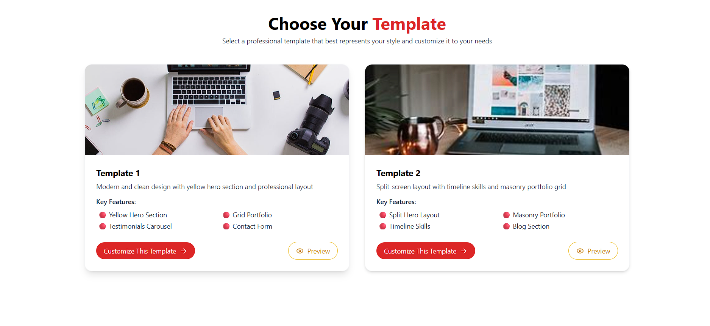
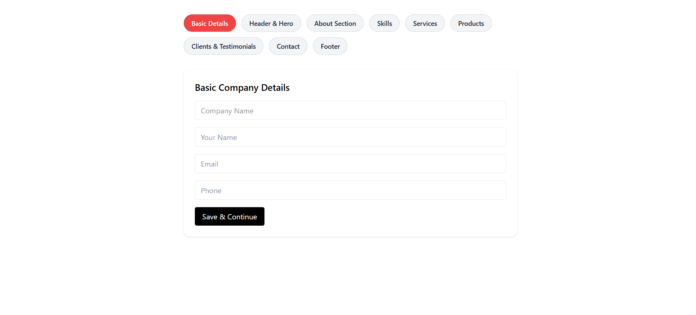
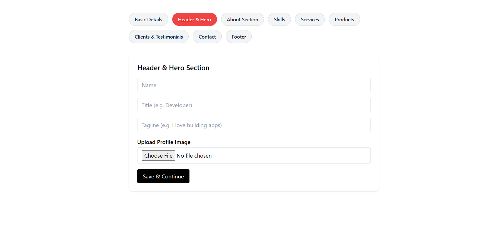
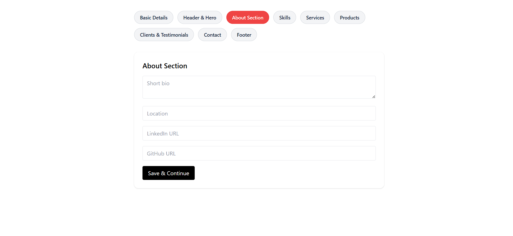
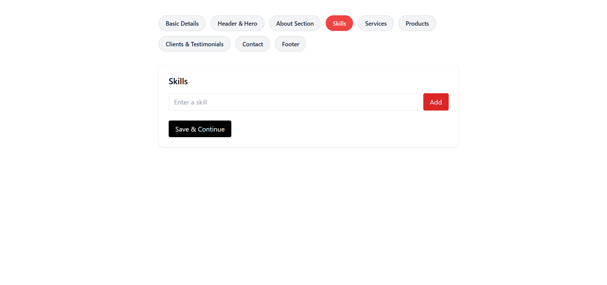
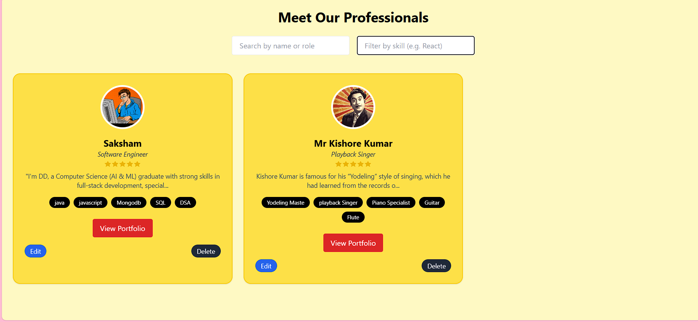
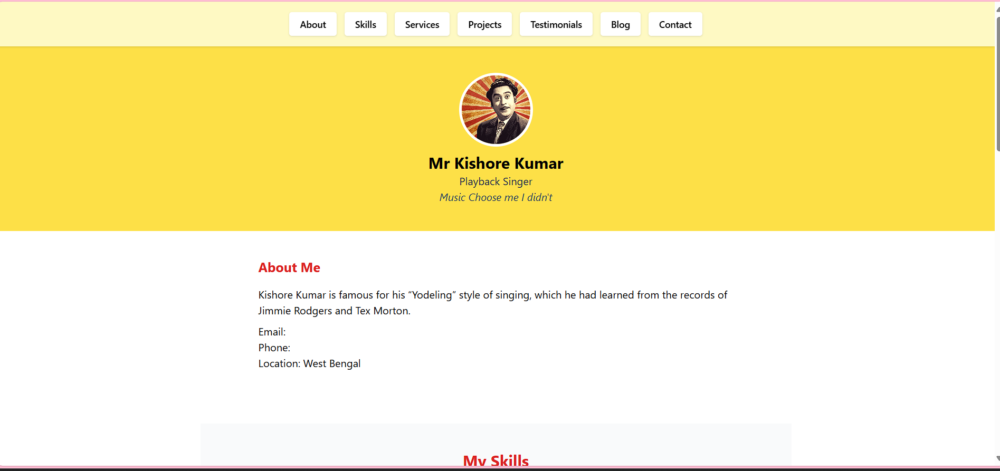
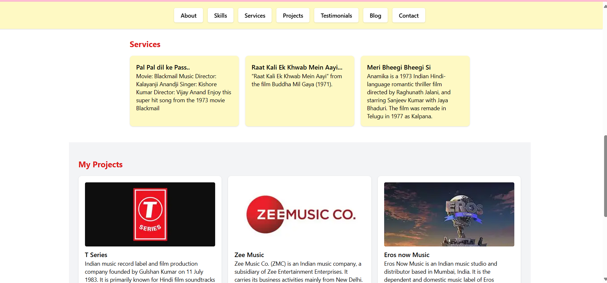

# Portfolio Generator App

A dynamic and customizable **Portfolio Generator** built with **React + TypeScript**, where users can:

🎨 Select from 2 portfolio templates  
📝 Fill out a multi-section form (Hero, About, Skills, Services, Projects, Testimonials, Blog, Contact, Footer)  
👨‍💼 View a list of professionals (profiles)  
🔗 View individual portfolio pages at `/portfolio/:id`  
🛠 Edit profiles and filter by skills or roles  
📦 Save everything locally using `localStorage`

---

## ✨ Features

- 🔘 Template Selection UI (2 layouts)
- 📄 Multi-step Portfolio Form:
  - Hero Section: Name, Title, Tagline, Image
  - About: Bio, Contact Info, Social Links
  - Skills: Dynamic list with progress bars
  - Services (3)
  - Projects (3) with images
  - Testimonials (1–3)
  - Blog Section (optional)
  - Contact Section (Phone, Email, Message)
- 🧑‍💻 Professionals List
- 📄 Dynamic Portfolio Page
- 🖊 Edit Profile
- 🔍 Filter by Skills / Role
- 🎯 Section-based navigation on portfolio
- ☁️ Fully localStorage-powered (no backend)
- 📱 Responsive Design

/portfolio-generator/screenshots/

## 📸 Screenshots

### 🟥 Template Selection

### 🟥 Multi-section Form

### 🟥 Profiles Page

### 🟥 Portfolio Detail View

